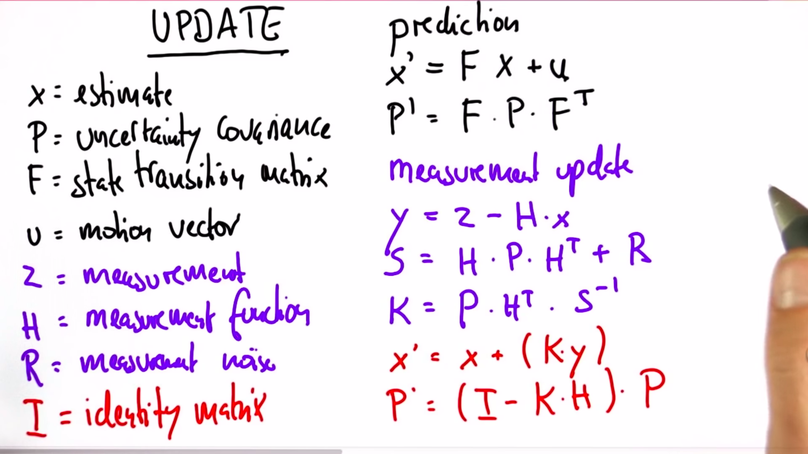

# Kalman Filters

Kalman Filters help self driving car finding other cars and predict their path so they don't crash into them.

It takes data from different sensors like LIDARS, radars which give distance data and kalman filter predicts the velocity and their futer position to avoid crash.

It is a continuos and uni-modal distributin unlike monte carlo(localisation) which is discrete and multi modal.

Kalman Filters are given by Gaussian function. It is represented by mean that is the width of the curve and variance(sigma squared).

Gaussian with least width is preferred.

Update function is used to update the mean and variance when new gaussian is found.

Kalman_Filter function updates the mean and variance over multiple measuremnets using these equations.

